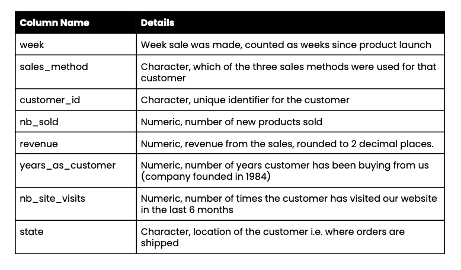

# **About Company**
**Pens and Printers** was founded in 1984 and provides high quality office products to large organizations. We are a trusted provider of everything from pens and notebooks to desk chairs and monitors. We don’t produce our own products but sell those made by other companies.
We have built long lasting relationships with our customers and they trust us to provide them with the best products for them. As the way in which consumers buy products is changing, our sales tactics have to change too. Launching a new product line is expensive and we need to make sure we are using the best techniques to sell the new product effectively. The best approach may vary for each new product so we need to learn quickly what works and what doesn’t.

# **Business Problem: New Product Sales Methods**
Six weeks ago we launched a new line of office stationery. Despite the world becoming increasingly digital, there is still demand for notebooks, pens and sticky notes.
Our focus has been on selling products to enable our customers to be more creative, focused on tools for brainstorming. We have tested three different sales strategies for this, targeted email and phone calls, as well as combining the two.

**Email**: Customers in this group received an email when the product line was launched, and a further email three weeks later. This required very little work for the team.

**Call**: Customers in this group were called by a member of the sales team. On average members of the team were on the phone for around thirty minutes per customer.

**Email and call**: Customers in this group were first sent the product information email, then called a week later by the sales team to talk about their needs and how this new product may support their work. The email required little work from the team, the call was around ten minutes per customer.

# **Tasks**

We need to know:
- How many customers were there for each approach?
- What does the spread of the revenue look like overall? And for each method?
- Was there any difference in revenue over time for each of the methods?
- Based on the data, which method would you recommend we continue to use? Some
of these methods take more time from the team so they may not be the best for us to use if the results are similar.

This report contains:

● Data validation:
- Describe validation and cleaning steps for every column in the data
  
● Exploratory Analysis to answer the customer questions ensuring you include:
- Two different types of graphic showing single variables only
- At least one graphic showing two or more variables
- Description of your findings
  
● Definition of a metric for the business to monitor
- How should the business monitor what they want to achieve?
- Estimate the initial value(s) for the metric based on the current data?
  
● Final summary including recommendations that the business should undertake

# **Data Information**

The sales rep has pulled some data from their sales tracking system for us. They haven’t included numbers for how much time was spent on each customer, but there may be some other useful customer information in here.
The data only relates to the new products sold. As there are multiple different products, the revenue will vary depending on which products were sold.

